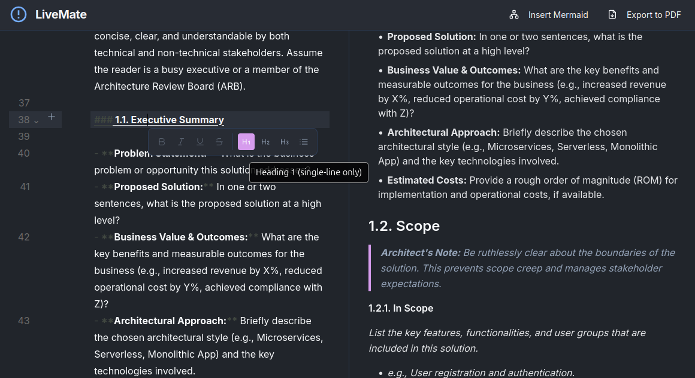
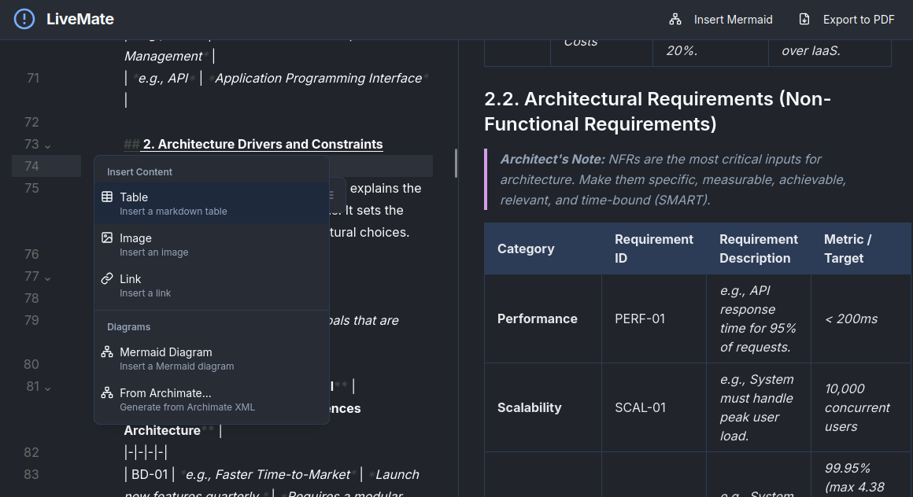

# LiveMate - ArchiMate to Markdown Utility

LiveMate is a polished Markdown workbench built for creating documentation and diagrams with helpful AI and diagram tooling. It pairs a fast CodeMirror-based editor with live previews, Mermaid diagram support, and optional AI-powered enhancements to streamline authoring.



<b>Proof of concept / Security notice: </b>
This project is provided as a proof of concept to showcase Markdown editor utilities and the Archimate to Mermaid diagram workflow. Several security and reliability issues remain (see `ISSUES.md`). DO NOT DEPLOY this code in production or on untrusted networks. Use the application only for demonstration purposes and within trusted, controlled environments.

Why use LiveMate
- Focused editing with fast Markdown rendering and line-aware editor actions
- Live Mermaid diagram rendering and inline validation
- Tools for converting Archimate models to Mermaid diagrams
- Optional AI flows for content enhancement and diagram descriptions



## Quick start
Prerequisites
- Node.js v18 or later
- npm (bundled with Node)

Install and run
```bash
git clone <repo-url>
cd LiveMate
npm install
npm run dev
```

Environment
- If you plan to use AI features (Genkit / Gemini), add a `.env` file with your key:
```env
GEMINI_API_KEY="YOUR_API_KEY_HERE"
```

Developer notes
- Main development server: `npm run dev`
- Genkit flows (AI flow server / UI): `npm run genkit:watch`
- Cloudflare Pages / Wrangler (when needed): `npm run dev:wrangler:build` and `npm run dev:wrangler:run`

Project layout (high level)
- `src/app/` — Next.js App router pages, layout, global styles
- `src/components/` — UI components and editor integrations
- `src/hooks/` — React hooks (Mermaid validation, editor gutters, Archimate parsing)
- `src/lib/` — Core utilities (archimate parser, mermaid generator, helpers)
- `src/ai/` — Genkit flows and config for AI-powered features
- `public/` — Static assets (e.g., `archimate.xml` sample)

Contributing
- See [CONTRIBUTING.md](docs/CONTRIBUTING.md) for contribution guidelines and development workflows.

License
- This project is licensed under the MIT License — see [LICENSE](LICENSE) for details.

